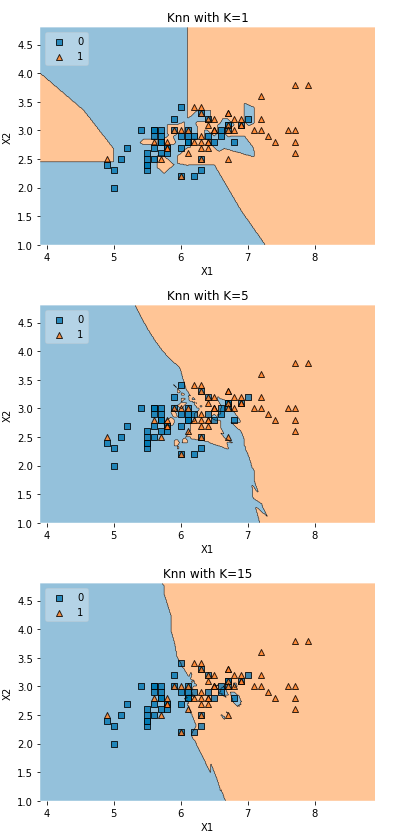
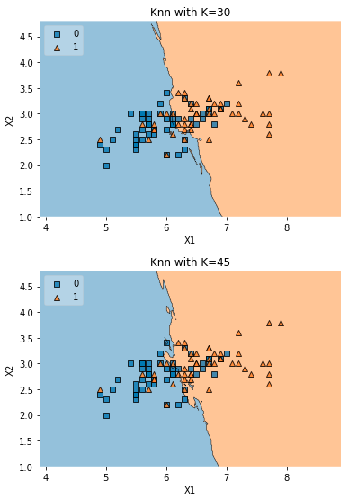

```python
import numpy as np
import matplotlib.pyplot as plt
from sklearn import datasets, neighbors
# https://anaconda.org/conda-forge/mlxtend
from mlxtend.plotting import plot_decision_regions
import pandas as pd
```

Function to plot the decision regions

```python
def knn_comparision(data, k):
    X = data[['x1','x2']].values
    y = data['y'].astype(int).values
    clf = neighbors.KNeighborsClassifier(n_neighbors=k)
    clf.fit(X, y)

    # Plotting decision regions
    plot_decision_regions(X, y, clf=clf, legend=2)

    # Adding axes annotations
    plt.xlabel('X1')
    plt.ylabel('X2')
    plt.title('Knn with K='+ str(k))
    plt.show()
```

Testing with sample data using different values of K

```python
data = pd.read_csv('demo_data/6.overlap.csv', names=['x1', 'x2', 'y'])
for i in [1, 5, 15, 30, 45]:
    knn_comparision(data, i)
```




- From this plots we can see that the decision boundary become more and more smooth with increase in K
- When K was 1 a single point has influced the decision boundary 
